# VoiceFlow Agent 设计文档

## 1. 项目背景

### 1.1 项目目标

VoiceFlow Agent 是一个纯语音驱动的 AI 工程绘图工具。用户只需按住按钮说出需求，系统自动完成**语音识别 → 意图理解 → Schema 生成 → Mermaid 编译 → SVG 渲染**，全程无需鼠标与键盘操作。

### 1.2 需求分析

传统绘图工具（Draw.io、Visio、ProcessOn）依赖鼠标拖拽和频繁的工具栏切换，绘制一张工程图往往需要数十分钟。核心痛点：

1. **操作门槛高**——需要熟悉特定工具的操作方式
2. **效率低**——拖拽对齐、连线、调样式耗时
3. **不适用无键鼠场景**——大屏演示、辅助场景、移动端无法高效操作

因此核心需求是：**用自然语言（语音）替代键鼠操作，用 AI 理解意图替代手动布局**。

### 1.3 技术选型

| 层级 | 技术 | 选型理由 |
|------|------|----------|
| 框架 | Next.js 16 + React 19 | 全栈能力（SSR + API Routes），生态成熟 |
| 语言 | TypeScript 5 | 类型安全，Zod 集成自然 |
| AI | DashScope（千问 LLM + 通义 ASR） | 国内可用，OpenAI SDK 兼容模式，支持 Function Calling + enable_thinking |
| 图表 | Mermaid 11 | 纯文本 DSL → SVG，支持 5+ 图表类型，浏览器端渲染 |
| 校验 | Zod 4 | 运行时类型校验，LLM 输出的结构化 JSON 可靠验证 |
| 样式 | Tailwind CSS 4 | 原子化 CSS，快速构建 UI |
| 测试 | Vitest 4 | 与 TypeScript 原生集成，速度快 |

---

## 2. 系统总体架构

### 2.1 系统架构图



### 2.2 核心模块设计

#### ASR 模块

- **位置**：`src/hooks/useSpeech.ts` + `src/app/api/speech/route.ts` + `src/lib/asr-pool.ts`
- **功能**：浏览器采集 PCM 16kHz 音频 → WebSocket 中继 → 通义 ASR 实时识别 → 文本回传
- **关键设计**：ASR 连接池（预连接降低时延 + 指数退避重连），WebSocket 双向中继

#### Agent 模块

- **位置**：`src/app/api/agent/route.ts` + `src/hooks/useDiagramAgent.ts`
- **功能**：接收文本指令 → 组装上下文 → 调用千问 LLM（Function Calling）→ 解析 Tool Call → SSE 流式返回指令
- **关键设计**：Plugin 驱动的动态 System Prompt + Tool 定义，enable_thinking 获取推理链，两轮重试容错

#### Diagram Engine

- **位置**：`src/core/`（schema.ts / validator.ts / compiler.ts / graph-repair.ts / diagram-state.ts / board-store.ts）
- **功能**：Schema 定义 → 标准化 → ID 生成 → 校验 → 图修复 → 编译为 Mermaid DSL → 状态管理（undo/redo/多画板）
- **关键设计**：Schema First + Discriminated Union + Plugin 架构，每种图类型独立 Schema/Validator/Compiler

#### Mermaid Renderer

- **位置**：`src/components/DiagramCanvas.tsx`
- **功能**：接收 Mermaid DSL → 调用 mermaid.render() → 渲染 SVG → 缩放/拖拽交互
- **关键设计**：原生 wheel 缩放 + drag-to-pan，theme: 'neutral'，securityLevel: 'loose'

---

## 3. 指令能力设计

### 3.1 计划支持能力

#### 图表创建

| 能力 | 预期行为 |
|------|----------|
| 创建流程图 | 用户描述流程 → 生成 flowchart TD，含 start/process/decision/end 节点 |
| 创建 ER 图 | 描述实体和关系 → 生成 erDiagram，含属性字段 |
| 创建架构图 | 描述系统分层 → 生成 flowchart LR + subgraph，含 group 分层 |
| 创建时序图 | 描述交互顺序 → 生成 sequenceDiagram，含 participants/messages |
| 创建思维导图 | 描述主题和分支 → 生成 mindmap，递归树结构 |
| 创建类图 | 描述类及关系 → 生成 classDiagram（计划中） |
| 创建甘特图 | 描述时间线和任务 → 生成 gantt（计划中） |

#### 图表编辑

| 能力 | 预期行为 |
|------|----------|
| 新增节点 | 在当前图上追加节点及连线 |
| 删除节点 | 移除指定节点及相关边 |
| 修改节点 | 修改节点标签、类型、颜色等属性 |
| 建立关系 | 在两个节点间添加边及标签 |
| 删除关系 | 移除指定边 |

#### 样式控制

| 能力 | 预期行为 |
|------|----------|
| 节点颜色 | 用户指定节点颜色 → LLM 输出 CSS 颜色值到 node.color |
| 分组颜色 | 架构图中指定层背景色 → LLM 输出 groupColors |
| 自动主题 | 无颜色指定时使用默认莫兰迪色系 |

#### Agent 能力

| 能力 | 预期行为 |
|------|----------|
| 多轮上下文记忆 | 每轮对话回传 Schema 摘要 + 操作日志 + 焦点节点 |
| 模糊匹配 | "把刚才那个节点改成蓝色"→ 自动解析引用目标 |
| 歧义澄清（Ask User） | 遇到不确定指令时反问用户澄清 |
| 自动结构修复 | Graph Repair 模块自动修复连通性问题 |
| 撤销/重做 | 快照式 undo/redo |
| 多画板 | 多个独立画板 + localStorage 持久化 |

---

### 3.2 实际完成能力

| 功能 | 状态 | 说明 |
|------|------|------|
| 流程图 (flowchart) | ✅ | flowchart TD，start/process/decision/end 节点，默认莫兰迪配色 |
| ER 图 (er) | ✅ | erDiagram，支持实体属性字段，多表关联 |
| 架构图 (architecture) | ✅ | flowchart LR + subgraph 分层，group + groupColors |
| 时序图 (sequence) | ✅ | sequenceDiagram，participants + messages |
| 思维导图 (mindmap) | ✅ | mindmap 递归树，按深度自动配色 |
| 新增节点 | ✅ | 多轮对话中增量追加节点和边 |
| 删除节点 | ✅ | 多轮对话中移除指定节点 |
| 修改节点 | ✅ | 修改 label/type/color/attributes |
| 建立/删除关系 | ✅ | 增量修改 edges 数组 |
| 节点颜色控制 | ✅ | LLM 输出 CSS 颜色值到 node.color |
| 分组背景色 | ✅ | 架构图 groupColors，LLM 按需输出 |
| 撤销/重做 | ✅ | 快照式 undo/redo |
| 清空画布 | ✅ | 独立 clear 工具，可 undo 恢复 |
| 多画板 | ✅ | BoardStore + localStorage |
| 上下文记忆 | ✅ | Schema 摘要 + 操作日志 + 焦点节点 + 完整树结构（mindmap） |
| 模糊引用解析 | ✅ | 基于 id_hint 映射 + label 模糊匹配 |
| Ask User（歧义反问） | ✅ | 独立 ask_user 工具，前端展示问题气泡 |
| 图连通性修复 | ✅ | 孤立节点桥接 + 连通分量合并 + 空图线性链 |
| SSE 流式思考 | ✅ | enable_thinking → reasoning_content → 前端实时展示 |
| 类图 (classDiagram) | ❌ | 未实现，原因见 3.3 |
| 甘特图 (gantt) | ❌ | 未实现，原因见 3.3 |
| SVG/PNG 导出 | ❌ | 前端基础导出按钮已有（ExportButton.tsx），功能未接 |
| Draw.io 导出 | ❌ | 未实现 |

---

### 3.3 未完成功能分析

#### 类图 (Class Diagram)

**原因**：比赛周期有限，且类图涉及复杂语义。

类图需要表达的核心概念：
- 类定义（名称、属性、方法）
- 继承关系（extends / 父类子类）
- 聚合与组合（has-a / part-of）
- 接口实现（implements）
- 访问修饰符（public / private / protected）
- 抽象类 / 静态成员

这些概念需要独立设计 ClassSchema，无法复用现有的 NodeGraphSchema 节点-边模型。需要在 Schema 层建模类的内部结构（属性列表 + 方法列表 + 修饰符），同时边需要支持多种关系类型（继承、实现、聚合、组合、关联、依赖）。插件化的架构已为此做好准备——新增 class.plugin.ts 并注册即可接入，不会影响现有图表类型。

**后续计划**：比赛结束后作为首个新增图表类型实现。

---

#### 甘特图 (Gantt Chart)

**原因**：经过实际尝试，发现两个阻断性问题：

1. **Mermaid 11.15.0 Gantt Bug**：当前 Mermaid 版本存在 Gantt 渲染问题——`endTime` 字段报错、日期解析 `Invalid date`、主题变量兼容性异常。这些问题属于 Mermaid 库本身，无法在应用层绕过。

2. **Schema 模型不兼容**：Gantt 的时间轴模型（section → task: start, duration）与当前通用的 NodeGraphSchema（nodes + edges）差异过大。需要设计独立的 GanttSchema：
```
{
  title, dateFormat, axisFormat,
  sections: [{ name, tasks: [{ label, status?, start, duration?, end? }] }]
}
```
这要求新增专属的 Schema、Validator、Compiler 三件套，以及对应的 promptHint。

虽然 Plugin 架构已为新类型做好准备，但考虑到 Mermaid 版本的 bug 和二开时间成本，在比赛周期内暂不实现。

**后续计划**：等 Mermaid 上游修复 Gantt 相关问题后，或直接 skip Mermaid 用自定义 Canvas 渲染时间轴。

---

#### SVG/PNG 导出 + Draw.io 导出

**原因**：作为辅助功能优先级较低，比赛周期内优先完成核心的图表类型和交互闭环。

SVG 导出基础代码已有（ExportButton.tsx），需补充：触发 Mermaid SVG 提取 → 包装完整 SVG 标签 → 触发下载。PNG 需额外通过 Canvas API 做 SVG → PNG 转换。Draw.io 导出需要研究其 XML 格式并编写转换器。

---

## 4. 架构演进与设计决策

### 4.1 第一版架构：Tool-Based Command Architecture

> 实现 PR：[#2 feat: 核心层重构 + Agent API Function Calling 重写 + 38 单测](https://github.com/yyy-router/VoiceFlow/pull/2)

**设计思路**：将原子操作暴露为独立的 Function Calling Tool。

```
add_node → add_edge → delete_node → update_node → delete_edge → ...
```

LLM 通过多次 Tool Call 逐步构建图结构，每次只修改一个元素。

**优点**：
- 控制力强——每个操作精确可控
- 易于调试——每步操作独立可回溯
- 符合直觉——操作粒度与用户指令对齐

**缺点**：
- Tool 数量过多（随图表类型线性增长）
- Token 消耗大——每次调用都需要完整的 messages 上下文
- 复杂图延迟明显——N 个节点需要 N+1 次 LLM 调用
- Mermaid 类型扩展困难——每增加一种图类型需要新增一组 Tool

**废弃原因**：生成一张中等复杂度的流程图需要 5-8 次 Function Calling 来回，延迟不可接受。

---

### 4.2 第二版架构：Schema-Based Diagram Architecture

> 实现 PR：[#6 feat: Diagram Agent 架构重构 —— 全量 Schema 重建 + 快照 undo/redo + Graph Repair](https://github.com/yyy-router/VoiceFlow/pull/6)

**设计思路**：LLM 一次输出完整的 Diagram Schema（结构化 JSON），通过 Zod 校验后由编译器统一生成 Mermaid DSL。

```
Natural Language → Diagram Schema (JSON) → Zod Validate → Mermaid Compiler → SVG
```

每个图表类型对应一个 `generate_<type>` Tool，参数是完整的 Schema 结构。

**收益**：
- Tool 数量从 N 个减到 1 个 per 图表类型
- 复杂图生成只需 1 次 LLM 调用
- JSON 输出比自由文本更可靠——Zod 校验保证结构正确
- Schema 是唯一数据源（Single Source of Truth）——便于 undo/redo 和增量编辑
- Mermaid DSL 生成逻辑集中在 Compiler，与 LLM 解耦

**关键设计决策**：
- 使用 Discriminated Union (`DiagramSchema = NodeGraphSchema | SequenceSchema | MindmapSchema`)，而非单一大一统类型
- 每种图类型独立 Schema → 独立校验逻辑 → 独立编译器
- 引入 Validator 中间层：parse（JSON 解析）→ normalize（ID 生成、边引用解析）→ validate（业务规则校验）

---

### 4.3 第三版架构：Plugin-Based Diagram Architecture

> 实现 PR：[#9 feat: Diagram Plugin Architecture —— Schema Union + Plugin Registry + 编译器/校验器重构](https://github.com/yyy-router/VoiceFlow/pull/9)

**设计思路**：将每种图类型的定义封装为 Plugin，通过注册中心统一管理。

```ts
interface DiagramPlugin<T> {
  type: string;                              // 图表类型标识
  toolDefinition: ChatCompletionTool;         // OpenAI Function Calling 定义
  schema: ZodSchema<T>;                      // Zod 数据校验
  compiler: (data: T) => string;             // Schema → Mermaid DSL
  validator: (data: unknown) => ValidationResult;  // 自定义校验
  promptHint: string;                        // 注入 System Prompt
}
```

**收益**：
- 新增图类型只需新建插件文件并 register，**无需修改任何核心代码**
- Agent Route 通过 `getTools()` / `getPromptHints()` 动态生成，与具体图表类型解耦
- 实现开闭原则（Open-Closed Principle）——对扩展开放，对修改封闭
- 每个插件独立文件，职责清晰，便于测试和维护

**当前内置插件**：flowchart / architecture / er / sequence / mindmap（共 5 个）

**扩展新类型的步骤**：
1. 定义 Zod Schema（如 `ClassSchema`）
2. 编写 Compiler（如 `compileClassDiagram`）
3. 编写 Validator
4. 编写 promptHint
5. 组装 Plugin 对象并注册

---

## 5. 核心技术难点

### 5.1 多轮上下文记忆

**问题**：用户多轮对话中，LLM 需要"记住"当前图的状态才能增量修改。直接回传完整 Schema 会浪费大量 token。

**方案**：
- 回传 Schema 摘要：节点列表（label + id + type + color + group + attributes）、边列表（from → to）、图类型
- 操作日志：最近 5 次操作（action + target）
- 焦点节点：最近一次修改涉及的节点
- Mindmap 特殊处理：回传完整递归树结构（`root` 字段），因为树状结构的上下文只需 root 即可表达全貌
- System Prompt 明确要求"保留用户未要求变更的部分"

**效果**：LLM 在多轮对话中能够基于当前图状态进行精确的增量编辑，而非每次重新生成。

---

### 5.2 图结构自动修复

**问题**：LLM 生成的节点和边可能不连通——孤立节点在 Mermaid 中会无序排列，影响可读性。

**方案**：在 Compiler 之前插入 Graph Repair 层，进行确定性修复：

1. **孤立节点桥接**：遍历所有入度/出度为 0 的节点，基于标签语义相似度（编辑距离）匹配最近的连通节点，自动添加桥接边
2. **连通分量合并**：检测图中独立的连通分量，在最长的两个分量之间添加桥接边
3. **空图线性链**：首次创建的节点没有任何边时，按创建顺序自动连成链
4. **去重**：移除重复边（同 from + to）

**位置**：`src/core/graph-repair.ts`，在 `validator` 之后、`compiler` 之前执行。

---

### 5.3 Mermaid 自动编译

**问题**：不同类型的 Mermaid DSL 语法差异大。flowchart 支持 subgraph 和 style，erDiagram 使用 `||--o{` 语法，sequenceDiagram 需要 participant 声明，mindmap 使用缩进而非连线。且需要处理中文 label 中的特殊字符、颜色值合法性、节点 ID 冲突等边界情况。

**方案**：
- 每种图类型独立 Compiler 函数（`compileFlowchart` / `compileArchitectureSubgraph` / `compileER` / `compileSequence` / `compileMindmap`）
- `sanitize()` 函数处理 label 中的特殊字符（括号、引号、换行）→ 替换为全角或安全等价字符
- `safeColor()` 校验颜色值——过滤中文颜色名，只允许 CSS 合法颜色
- 架构图使用 subgraph 包裹同 group 节点，`LR` 方向布局
- 思维导图使用 `%%{init}%%` 主题变量实现节点着色（Mermaid mindmap 不支持 style/classDef 指令）
- `mermaidConfig()` 根据节点数量动态调整字体大小和间距

---

### 5.4 插件化图类型扩展

**问题**：流程图、ER 图、架构图、时序图、思维导图的 Tool 定义、Schema、校验规则、编译逻辑各不相同。硬编码会导致 Agent Route 膨胀，且新增类型时需要修改多处核心代码。

**方案**：`DiagramPlugin<T>` 接口将每种图类型的所有差异封装在一个对象中。

- `registry.ts` 提供 `registerPlugin()` / `getTools()` / `getPromptHints()` 等统一入口
- Agent Route 只依赖 registry 的接口，不感知具体插件
- 动态 import（`await import('./flowchart.plugin')`）避免循环依赖
- Tool name 自动映射 diagramType：`generate_<name>` → `<name>`

---

### 5.5 Ask User 歧义处理

**问题**：用户语音指令可能存在歧义——"把那个节点删掉"（指哪个？）、"把用户表改个名字"（改成什么？）。LLM 在不明确时不应猜测，而应反问澄清。

**方案**：
- `ask_user` 作为独立 Function Calling Tool，参数为 `{ question: string }`
- System Prompt 引导 LLM 在遇到歧义时调用 ask_user 而非猜测
- 前端将 ask_user 指令渲染为琥珀色问题气泡
- 用户的下一轮语音输入作为答案回传，LLM 继续执行原意图
- 与其他 Tool 平级，LLM 可自主选择立即反问或先执行确定部分再反问

---

## 6. 项目总结与展望

### 已实现目标

- 5 种图表类型：流程图 / ER 图 / 架构图 / 时序图 / 思维导图
- 纯语音驱动闭环：ASR → LLM → Schema → Mermaid → SVG
- Schema First 架构 + Plugin 引擎 + Graph Repair
- 多轮上下文记忆 + 增量编辑 + 模糊引用解析
- 多画板 + localStorage 持久化
- SSE 流式思考过程展示
- Ask User 歧义反问
- 50 个单元测试（Vitest）

### 存在问题

1. **ASR 识别精度**：通义 ASR 对中英文混合术语（如 "Mermaid Compiler"）识别率有限，需用户使用纯中文表达
2. **LLM 输出不稳定性**：偶有 JSON 格式错误（参数 key 拼写错误、多余字段），Validator 层已做防御但仍有失败概率
3. **Mermaid 版本 Bug**：甘特图渲染存在 Mermaid 11.15.0 已知问题，当前无法绕过
4. **大图性能**：节点数 > 30 时 Mermaid 渲染性能下降，需添加虚拟化或分页
5. **移动端适配**：当前 UI 以桌面端为主，移动端未做适配

### 后续规划

- 类图 / 状态图支持（Plugin 架构已就绪）
- SVG / PNG 导出完善
- Draw.io 格式导出
- MCP Integration（作为 MCP Server 供其他 Agent 调用）
- Agent Workflow Builder（多步骤编排）
- 暗色主题
- 移动端适配
